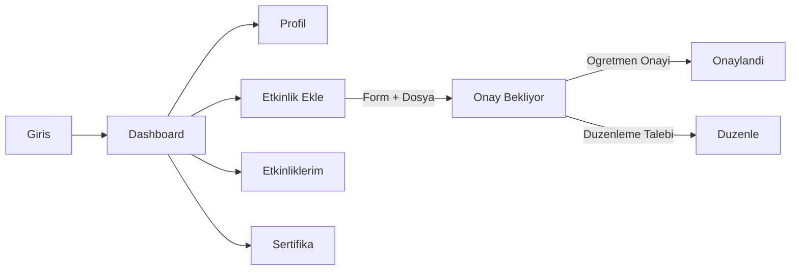
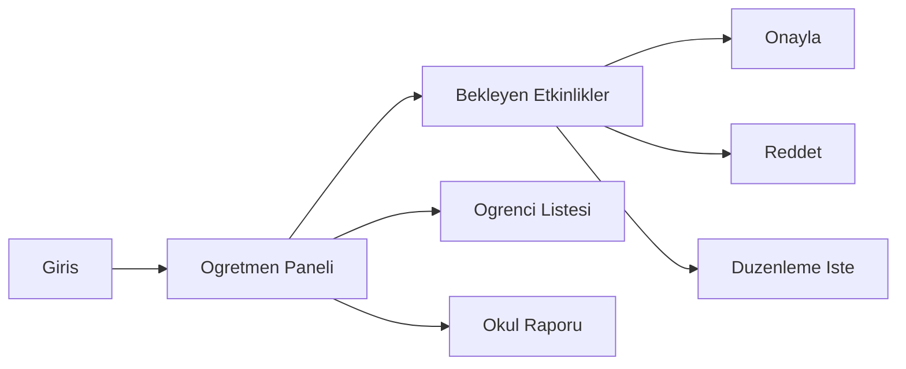
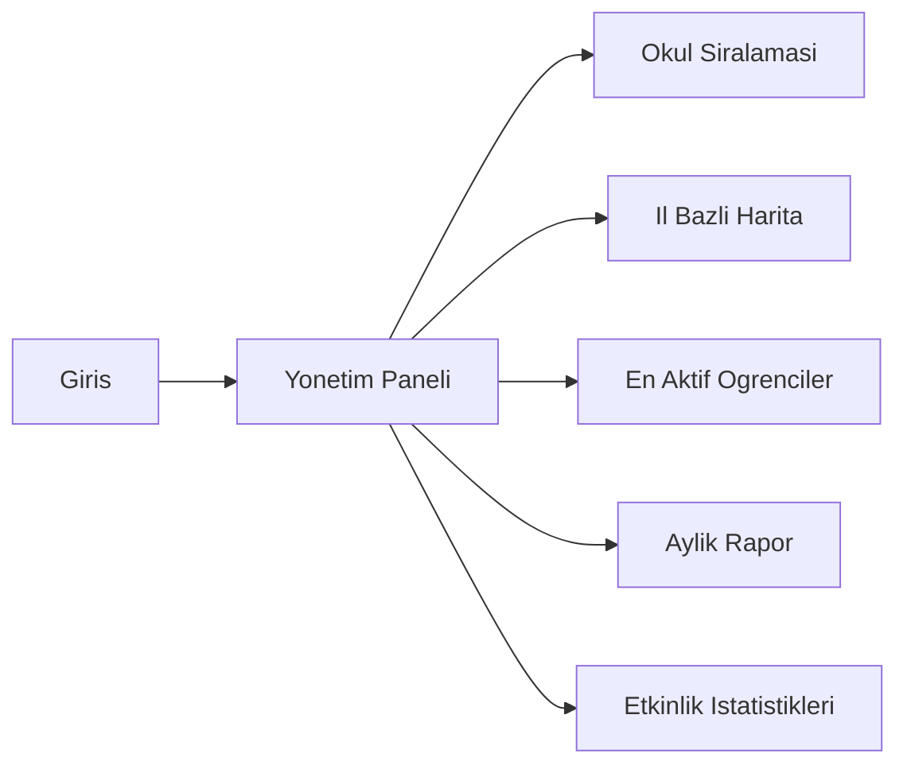

# LÖSEV İnci Gönüllülük Takip Sistemi - Detaylı Plan

## Teknoloji Kararları


| Katman | Seçim | Gerekçe |
| ------ | ----- | ------- |


- **Frontend**: Next.js 14 (App Router) -- SSR desteği, API routes ile tek proje, React ekosistemi
- **Backend**: Next.js API Routes + Server Actions -- ayrı backend gerektirmez, hızlı geliştirme
- **Veritabanı**: PostgreSQL (Supabase hosted) -- ilişkisel veri modeli için ideal, Supabase ile kolay kurulum
- **ORM**: Prisma -- type-safe sorgular, migration yönetimi, kolay schema tanımı
- **Kimlik Doğrulama**: NextAuth.js (Auth.js v5) -- rol bazlı yetkilendirme, credentials provider
- **Dosya Yükleme**: Supabase Storage -- ücretsiz katman yeterli, kolay entegrasyon
- **UI Framework**: Tailwind CSS + shadcn/ui -- modern, erişilebilir, hızlı geliştirme
- **Grafik/Raporlama**: Recharts -- React-native, responsive grafikler
- **Sertifika Üretimi**: html2canvas + jsPDF -- client-side PDF sertifika oluşturma
- **Dil**: TypeScript -- tip güvenliği, daha az hata

## Veri Modeli (Prisma Schema)

```prisma
enum Role {
  STUDENT
  TEACHER
  ADMIN
}

enum ActivityStatus {
  PENDING
  APPROVED
  REJECTED
  REVISION_REQUESTED
}

enum ActivityType {
  SEMINER
  STANT
  BAGIS
  KERMES
  KAMUSAL_BILINCLENDIRME
  SOSYAL_MEDYA
  FARKINDALIK
  DIGER
}

enum BadgeLevel {
  NONE
  BRONZE    // 25 saat
  SILVER    // 50 saat
  GOLD      // 100 saat
  PLATINUM  // 200+ saat
}

model User {
  id              String    @id @default(cuid())
  email           String    @unique
  password        String    // hashed
  name            String
  role            Role
  phone           String?
  tcKimlik        String?   // encrypted, opsiyonel
  createdAt       DateTime  @default(now())

  student         Student?
  teacher         Teacher?
}

model School {
  id        String    @id @default(cuid())
  name      String
  city      String
  district  String
  students  Student[]
  teachers  Teacher[]
}

model Student {
  id              String      @id @default(cuid())
  userId          String      @unique
  user            User        @relation(fields: [userId], references: [id])
  schoolId        String
  school          School      @relation(fields: [schoolId], references: [id])
  grade           String      // 5-12
  coordinatorId   String?
  coordinator     Teacher?    @relation(fields: [coordinatorId], references: [id])
  targetHours     Int         @default(30)
  activities      Activity[]
  totalHours      Float       @default(0) // denormalized for performance
  badgeLevel      BadgeLevel  @default(NONE)
}

model Teacher {
  id        String    @id @default(cuid())
  userId    String    @unique
  user      User      @relation(fields: [userId], references: [id])
  schoolId  String
  school    School    @relation(fields: [schoolId], references: [id])
  students  Student[]
}

model Activity {
  id          String         @id @default(cuid())
  studentId   String
  student     Student        @relation(fields: [studentId], references: [id])
  date        DateTime
  type        ActivityType
  hours       Float
  description String
  photos      String[]       // Supabase Storage URLs
  documents   String[]       // Supabase Storage URLs
  status      ActivityStatus @default(PENDING)
  reviewNote  String?
  reviewedAt  DateTime?
  reviewedBy  String?
  createdAt   DateTime       @default(now())
}
```

## Sayfa ve Bileşen Yapısı

```
src/
├── app/
│   ├── layout.tsx                    # Root layout (Navbar, Auth provider)
│   ├── page.tsx                      # Landing / Login sayfası
│   ├── auth/
│   │   ├── login/page.tsx            # Giriş formu
│   │   └── register/page.tsx         # Kayıt formu (rol seçimi)
│   ├── student/
│   │   ├── layout.tsx                # Öğrenci layout (sidebar)
│   │   ├── dashboard/page.tsx        # Saat özeti, rozet, son etkinlikler
│   │   ├── profile/page.tsx          # Profil düzenleme
│   │   ├── activities/
│   │   │   ├── page.tsx              # Etkinlik listesi
│   │   │   └── new/page.tsx          # Yeni etkinlik ekleme formu
│   │   └── certificate/page.tsx      # Sertifika görüntüleme/indirme
│   ├── teacher/
│   │   ├── layout.tsx
│   │   ├── dashboard/page.tsx        # Okul özet istatistikleri
│   │   ├── activities/page.tsx       # Onay bekleyen etkinlikler
│   │   ├── students/page.tsx         # Öğrenci listesi ve saatleri
│   │   └── reports/page.tsx          # Okul performans grafikleri
│   ├── admin/
│   │   ├── layout.tsx
│   │   ├── dashboard/page.tsx        # Türkiye geneli özet
│   │   ├── schools/page.tsx          # Okul sıralaması
│   │   ├── cities/page.tsx           # İl bazlı etki haritası
│   │   ├── students/page.tsx         # En aktif öğrenciler
│   │   └── reports/page.tsx          # Detaylı raporlama
│   └── api/
│       ├── auth/[...nextauth]/       # NextAuth endpoint
│       ├── students/                 # CRUD
│       ├── activities/               # CRUD + onay
│       ├── schools/                  # Okul yönetimi
│       ├── reports/                  # Raporlama endpoint'leri
│       └── upload/                   # Dosya yükleme
├── components/
│   ├── ui/                           # shadcn/ui bileşenleri
│   ├── forms/
│   │   ├── ActivityForm.tsx
│   │   ├── ProfileForm.tsx
│   │   └── LoginForm.tsx
│   ├── charts/
│   │   ├── HoursChart.tsx            # Aylık saat grafiği
│   │   ├── ActivityTypeChart.tsx     # Etkinlik türü dağılımı
│   │   └── SchoolRankingChart.tsx
│   ├── BadgeDisplay.tsx              # Rozet gösterimi
│   ├── CertificateTemplate.tsx       # PDF sertifika şablonu
│   ├── ActivityCard.tsx              # Etkinlik kartı
│   ├── StatsCard.tsx                 # İstatistik kartı
│   └── Navbar.tsx
├── lib/
│   ├── prisma.ts                     # Prisma client
│   ├── auth.ts                       # NextAuth config
│   ├── utils.ts                      # Yardımcı fonksiyonlar
│   ├── badges.ts                     # Rozet hesaplama mantığı
│   └── validators.ts                 # Zod şemaları (form validation)
└── prisma/
    ├── schema.prisma
    └── seed.ts                       # Demo veri
```

## Rol Bazlı Ekran Akışları

### Ogrenci Akisi




### Ogretmen Akisi




### Genel Merkez Akisi




## Rozet / Sertifika Mantigi

Dosya: `lib/badges.ts`

```typescript
export function calculateBadge(totalHours: number): BadgeLevel {
  if (totalHours >= 200) return 'PLATINUM';
  if (totalHours >= 100) return 'GOLD';
  if (totalHours >= 50)  return 'SILVER';
  if (totalHours >= 25)  return 'BRONZE';
  return 'NONE';
}
```

Bir etkinlik onaylandiginda:

1. Ogrencinin `totalHours` alani guncellenir
2. `calculateBadge()` ile yeni rozet seviyesi belirlenir
3. Rozet degistiyse ogrenci bilgilendirilir

## KVKK ve Guvenlik Onlemleri

- TC Kimlik numarasi AES-256 ile sifrelenerek saklanir (veritabaninda encrypted)
- Parolalar bcrypt ile hashlenir (NextAuth credentials provider)
- Tum API route'lari middleware ile rol kontrolunden gecer
- Dosya yuklemeleri sadece onaylanan MIME tipleri kabul eder (image/*, application/pdf)
- Ogrenci verileri sadece kendi koordinatoru ve admin tarafindan gorulebilir
- Rate limiting uygulanir (next-rate-limit veya upstash ratelimit)
- Veli izin sureci: Kayit sirasinda dijital veli onay formu zorunlu tutulur
- HTTPS zorunlulugu (Vercel default)
- Environment variable'lar `.env.local` dosyasinda saklanir, repo'ya eklenmez

## API Endpoint Ozeti

- `POST /api/auth/register` -- Yeni kullanici kaydi
- `POST /api/auth/[...nextauth]` -- Giris/cikis
- `GET/PUT /api/students/profile` -- Ogrenci profili
- `GET/POST /api/activities` -- Etkinlik listesi / yeni etkinlik
- `GET /api/activities/[id]` -- Etkinlik detayi
- `PUT /api/activities/[id]/review` -- Ogretmen onay/red
- `POST /api/upload` -- Dosya yukleme
- `GET /api/reports/school/[id]` -- Okul raporu
- `GET /api/reports/city/[city]` -- Il bazli rapor
- `GET /api/reports/overview` -- Genel merkez ozet
- `GET /api/reports/top-students` -- En aktif ogrenciler
- `GET /api/reports/top-schools` -- En aktif okullar
- `GET /api/certificate/[studentId]` -- Sertifika PDF

## Adim Adim Uygulama Plani

### Adim 1: Proje Iskeleti

- `npx create-next-app@latest` ile Next.js projesi olustur (TypeScript, Tailwind, App Router)
- shadcn/ui kur ve temel bileşenleri ekle
- Prisma kur, schema.prisma dosyasını yaz
- Supabase projesi olustur (PostgreSQL + Storage)
- `.env.local` dosyasini ayarla (DATABASE_URL, NEXTAUTH_SECRET, SUPABASE keys)

### Adim 2: Kimlik Dogrulama

- NextAuth.js (Auth.js v5) credentials provider kurulumu
- Kayit formu (rol secimli: ogrenci/ogretmen)
- Giris formu
- Middleware ile rol bazli route korumasi (`/student/*`, `/teacher/*`, `/admin/*`)

### Adim 3: Ogrenci Modulu

- Profil formu (ad, okul, sinif, il/ilce, telefon, e-posta, koordinator secimi)
- Etkinlik ekleme formu (tarih, tur, saat, aciklama, dosya yukleme)
- Etkinliklerim listesi (durum filtreleme: bekliyor/onaylandi/reddedildi)
- Dashboard: toplam saat, aylik saat, yillik saat, hedef ilerleme cubugu, rozet

### Adim 4: Ogretmen Modulu

- Onay bekleyen etkinlikler listesi
- Etkinlik detay modali (fotograflari ve belgeleri goruntuleme)
- Onayla / Reddet / Duzenleme Talep Et aksiyonlari
- Ogrenci listesi ve bireysel saat ozeti
- Okul bazli toplam saat ve performans grafigi

### Adim 5: Genel Merkez Modulu

- Turkiye geneli ozet dashboard (toplam saat, toplam ogrenci, toplam etkinlik)
- Okul siralaması tablosu (siralanabilir, filtrelenebilir)
- Il bazli istatistik sayfasi
- En aktif 10 ogrenci ve 10 okul listeleri
- Aylik faaliyet dagilim grafigi (Recharts)
- Etkinlik turune gore pasta grafigi

### Adim 6: Sertifika ve Rozet Sistemi

- Rozet hesaplama mantigi ve otomatik guncelleme
- Ogrenci profilinde rozet gosterimi (Bronz/Gumus/Altin/Platin)
- PDF sertifika sablonu tasarimi
- Sertifika indirme fonksiyonu
- Okul performans rozetleri (Inci Dostu Okul, Sosyal Etki Lideri, Yilin Okulu)

### Adim 7: Son Dokunuslar

- Responsive tasarim kontrolu (mobil oncelikli)
- Seed data ile demo senaryo hazirlama
- Hata yonetimi ve loading state'ler
- README.md dokumantasyonu

